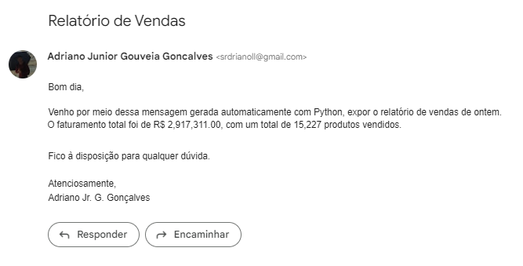

# Automação de relatório de vendas

## Sumário

* [Sobre o projeto](#sobre-o-projeto)
* [About the project](#about-the-project)
* [Linguagens e tecnologias usadas](#linguagens-e-tecnologias-usadas)
* [Bibliotecas usadas](#bibliotecas-usadas)
* [Passo a passo das soluções](#passo-a-passo-das-soluções)
* [Captura de tela](#captura-de-tela)
* [Conclusões](#conclusões)
* [Créditos](#créditos)
* [Contato](#contato)

## Sobre o projeto

Esse repositório contém uma solução para um desafio envolvendo automação e é organizado de maneira detalhada e acessível, podendo ser entendida por quem está iniciando na linguagem Python. Esse é um projeto de portfólio, que também tem como objetivo colocar em prática, bem como documentar, alguns dos meus conhecimentos na linguagem, por isso, nem sempre desenvolvo a Solução Detalhada da maneira mais objetiva.

**Desafio:** Automatizar o processo de acessar os dados de vendas de uma empresa, calcular o faturamento e a quantidade total de produtos vendidos no dia anterior e enviar um e-mail com essas informações. Esse envio de relatório pode ser parte do trabalho diário de um analista de uma empresa.

Estão disponibilizados neste repositório os seguintes arquivos: a base de vendas, que contém informações de aproximadamente 7.000 vendas; uma solução detalhada usando PyAutoGUI, uma biblioteca do Python para automação de comandos do mouse e do teclado; duas soluções finais, uma adaptada para o Visual Studio Code a partir da solução detalhada, mas desenvolvidas sem a poluição visual dos comentários, e outra, uma versão alternativa, usando Selenium, que é capaz de automatizar atividades de navegadores; e a pasta com a captura de tela de como ficou a mensagem do e-mail.

## About the project

This repository contains a solution to a challenge involving automation and is organized in a detailed and accessible way, which can be understood by those who are starting in the Python language.

**Challenge:** Automate the process of accessing a company's sales data, calculating revenue and the total quantity of products sold the previous day, and sending an email with this information. This report submission can be part of the day-to-day work of a company analyst.

The following files are available in this repository: a detailed solution using PyAutoGUI, a Python library for automating mouse and keyboard commands; two final solutions, one adapted for Visual Studio Code from the detailed solution, but developed without the visual pollution of comments, and another, an alternative version, using Selenium, which is capable of automating browser activities; and the folder with the screenshot of how the email message turned out.

## Linguagens e tecnologias usadas

* [Jupyter Notebook](https://jupyter.org/)
* [Visual Studio Code](https://code.visualstudio.com/download)
* [Python 3.11](https://www.python.org/)
* [Markdown](https://www.markdownguide.org/)

## Bibliotecas usadas

* [Pandas](https://pandas.pydata.org/)
* [Time](https://docs.python.org/3/library/time.html)
* [smtplib](https://docs.python.org/3/library/smtplib.html)
* [email.message](https://docs.python.org/3/library/email.message.html)
* [PyAutoGUI](https://pyautogui.readthedocs.io/en/latest/)
* [Pyperclip](https://pypi.org/project/pyperclip/)
* [Selenium](https://selenium-python.readthedocs.io/)

## Passo a passo das soluções

* Passo 1: Entrando no sistema da empresa
* Passo 2: Navegando no sistema e encontrando a base de vendas
* Passo 3: Fazendo o download da base de vendas
* Passo 4: Importando a base de vendas pro Python
* Passo 5: Calculando os indicadores
* Passo 6: Enviando o relatório por e-mail

## Captura de tela 

O e-mail enviado no final do código pode ser visto abaixo.

## Conclusões

Ambas as soluções, cumprem com seus objetivos, mas com suas limitações. A primeira desenvolvida foi com PyAutoGUI, uma biblioteca que poderia ser melhorada ao disponibilizar maneiras de colocar caracteres especiais em alguns comandos, talvez usando o mesmo método que o LaTex. Um ponto curioso dessa biblioteca é que seus bugs são comumente resolvidos dando um intervalo para a próxima linha de código. Por conta disso, as bibliotecas 'pyperclip' e 'time' combinaram muito bem com ela, tendo por vezes uma situação de extrema dependência.

Os principais problemas encontrados foram: Não pode usar o computador enquanto ele roda o algoritmo; Precisa fazer adaptações ao mudar de computador, por conta do comando 'pyautogui.click()' usar como referência a quantidade de pixels da tela para saber onde clicar; Os tempos de espera, por serem arbitrários, podem ter situações que não sejam suficientes ou que sejam mais que o necessários, dependendo principalmente da velocidade de internet e do processamento do computador.

O Selenium é uma opção melhor para trabalhar, mas é limitada ao uso no navegador. Com essa biblioteca, é possível melhorar as questões problemáticas citadas anteriormente: pode-se fazer a automação rodar em segundo plano; Não é preciso muitas alterações para rodar em outro computador, muitas vezes nem é necessário; Não precisa por tempo de espera no caso de carregamento da página, pois assim que a página abre os próximos comando são realizados automaticamente. Entretanto, ainda é preciso colocar tempos de espera arbitrários quando se está abrindo caixas de diálogo ou pequenas alterações dentro da própria página.

Apesar das limitações, os códigos funcionam e podem ser adaptados para entrar no sistema de uma dada empresa, mesmo se precisar fazer login. Uma questão para prestar atenção caso faça a adaptação é que o código não reconhece sozinho o arquivo correto para baixar, nem qual importar para o Python, se fosse um trabalho diário com um arquivo correto todos os dias, teria que fazer um processo de automação para essas etapas também. 

Podemos ainda pensar em algumas possibilidades de melhoria para o código, como otimizar o tempo de resposta, incluir a data e o arquivo excel no e-mail e agendar o programa para executar automaticamente.

## Créditos 

O desafio, bem como muitos detalhes de sua resolução se devem ao João Lira, do canal do Youtube [Hashtag Programação](https://www.youtube.com/@HashtagProgramacao). Após meus apontamentos sobre os pontos negativos do PyAutoGUI, o meu amigo pessoal, [Lucas Corbanez](https://github.com/Corbanez97), sugeriu o uso do Selenium.

## Contato

Criado por Adriano Jr. G. Gonçalves - Sinta-se à vontade para contribuições, críticas, dúvidas e/ou sugestões.

 
   
  

